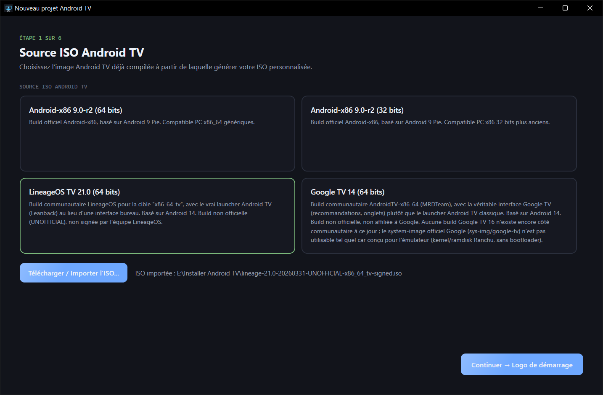
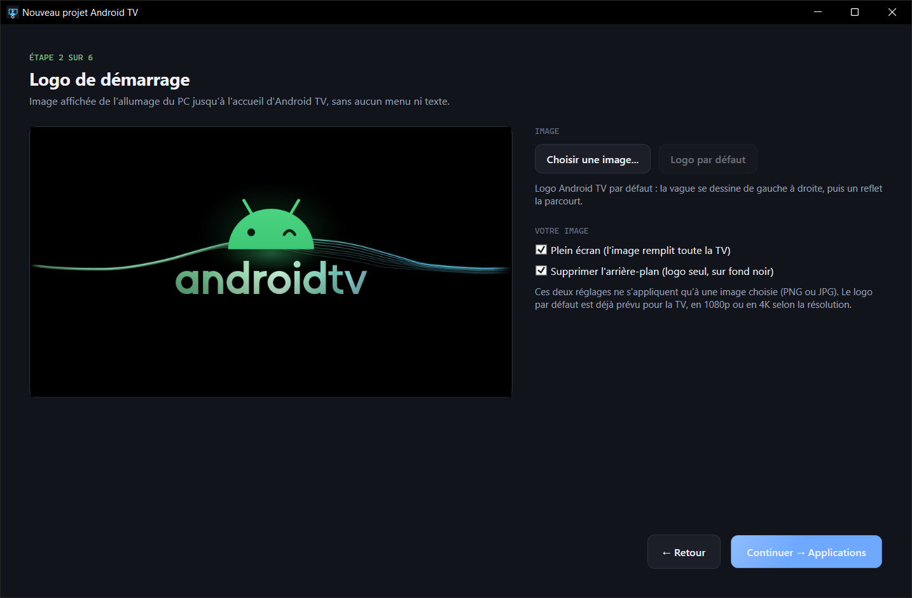
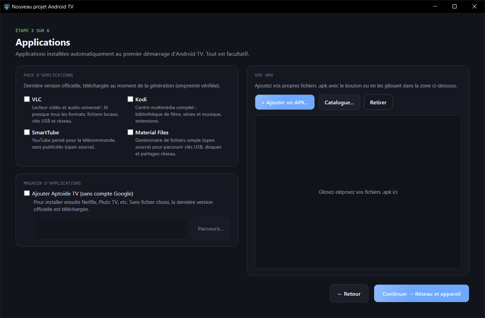
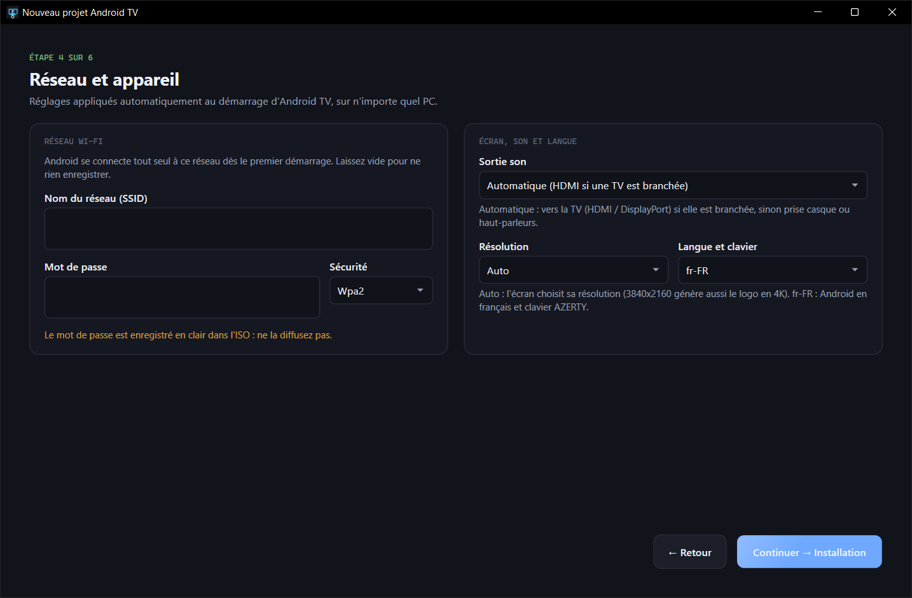
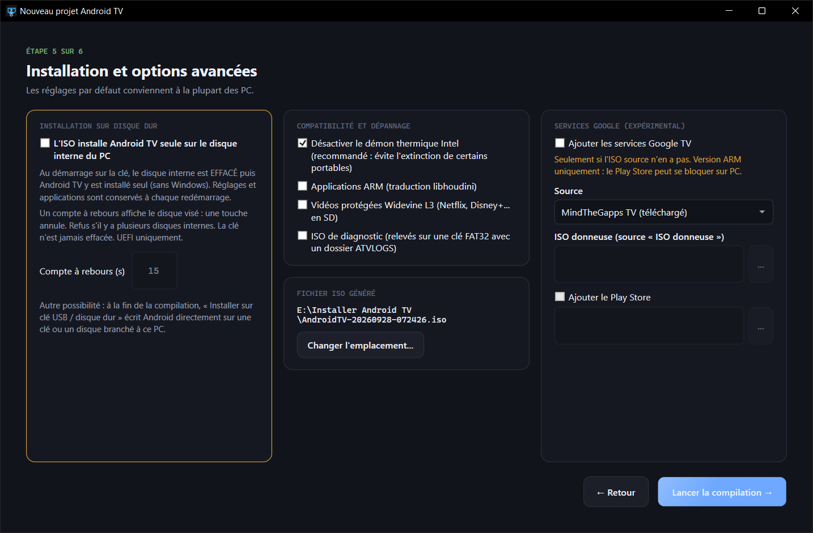
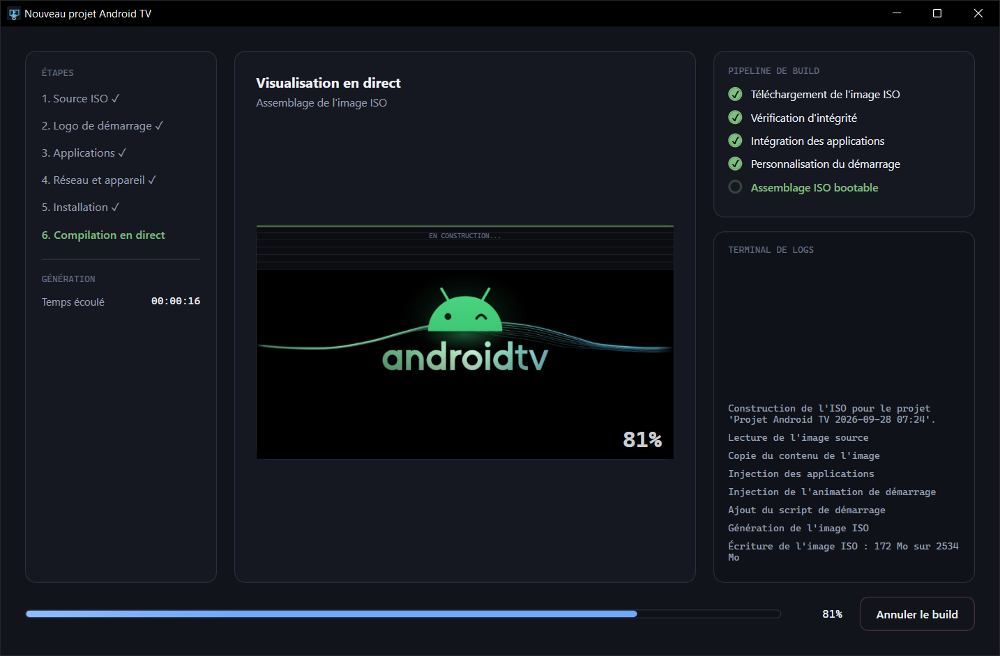

# 📺 AndroidTvPcIsoBuilder

### Transformez n'importe quel PC en boîtier Android TV.

*Choisissez une image Android TV, ajoutez vos applications, votre Wi-Fi et votre logo : le logiciel crée une clé ou une ISO qui démarre directement sur votre logo, jusqu'à l'accueil Android TV, sans aucun menu ni texte.*

 

 

<i>L'écran d'accueil du logiciel.</i>

  

[**Pourquoi**](#-pourquoi-androidtvpcisobuilder-) · [**Fonctionnalités**](#-fonctionnalités) · [**En images**](#-en-images) · [**Télécharger**](#%EF%B8%8F-télécharger) · [**Questions fréquentes**](#-questions-fréquentes)

 

---

## 💡 Pourquoi AndroidTvPcIsoBuilder ?

Un vieux PC, un mini-PC ou un portable qui dort dans un placard fait un excellent **boîtier Android TV** pour le salon. Mais l'installer soi-même, c'est long et plein de pièges : image introuvable, menus de démarrage incompréhensibles, pas de son sur la TV, Wi-Fi et applications à refaire à chaque fois…

**AndroidTvPcIsoBuilder fait tout à votre place, en six étapes guidées.** Le résultat démarre comme un vrai boîtier du commerce : votre logo à l'allumage, puis directement l'accueil Android TV, **déjà en français, déjà connecté au Wi-Fi, avec vos applications installées**.

 

## ✨ Fonctionnalités

<table>
<tr>
<td width="50%" valign="top">

### 🎬 Un démarrage digne d'un boîtier
- **Aucun menu, aucun texte** à l'écran pendant le démarrage.
- **Votre logo** de l'allumage jusqu'à Android TV.
- **Logo Android TV animé** fourni, net en Full HD comme en 4K.
- Ou **votre propre image**, avec suppression automatique du fond.

</td>
<td width="50%" valign="top">

### 📦 Applications prêtes à l'emploi
- **VLC, Kodi, SmartTube, Material Files** : un clic, dernière version officielle.
- **Vos propres APK**, par simple glisser-déposer.
- **Aptoide TV** pour installer ensuite Netflix, Pluto TV, etc.
- Tout est installé **automatiquement au premier démarrage**.

</td>
</tr>
<tr>
<td width="50%" valign="top">

### 📡 Réglé d'avance
- **Wi-Fi enregistré** : connexion automatique dès le premier allumage.
- **Son sur la TV** en HDMI, automatiquement.
- **Français et clavier AZERTY**.
- **Résolution** automatique ou imposée (720p, 1080p, 4K).
- Arrivée **directe sur l'accueil**, sans assistant de configuration.

</td>
<td width="50%" valign="top">

### 💾 Clé USB ou disque dur
- **Écriture directe sur clé USB** en un clic, en fin de création.
- **Mémoire persistante** : applications et réglages conservés à chaque redémarrage.
- **Installation sur le disque dur** du PC (Android seul).
- **Mode diagnostic** pour dépanner un PC récalcitrant.

</td>
</tr>
</table>

 

## 🖼️ En images

<table>
<tr>
<td width="50%" align="center">
 
<b>1 · Choix de l'image Android TV</b> Le logiciel reconnaît tout seul l'image importée.
</td>
<td width="50%" align="center">
 
<b>2 · Logo de démarrage</b> Aperçu animé, exactement comme sur la TV.
</td>
</tr>
<tr>
<td width="50%" align="center">
 
<b>3 · Applications</b> Pack d'applications, vos APK, magasin Aptoide TV.
</td>
<td width="50%" align="center">
 
<b>4 · Réseau et appareil</b> Wi-Fi, son, résolution, langue et clavier.
</td>
</tr>
<tr>
<td width="50%" align="center">
 
<b>5 · Installation</b> Clé USB, disque dur et options avancées.
</td>
<td width="50%" align="center">
 
<b>6 · Création en direct</b> Vous suivez chaque étape, puis vous écrivez la clé en un clic.
</td>
</tr>
</table>

 

## ⬇️ Télécharger

### [**➜ Page de téléchargement (dernière version)**](https://github.com/lerapeurdu62280-debug/AndroidTvPcIsoBuilder-Download/releases/latest)

| Fichier | Pour qui ? |
|---|---|
| **`AndroidTvPcIsoBuilder-Setup.exe`** | Installation classique, avec raccourci dans le menu Démarrer. **Recommandé.** |
| **`AndroidTvPcIsoBuilder-Portable.exe`** | Aucune installation : un seul fichier, à lancer depuis n'importe quel dossier ou clé USB. |

> **Windows affiche « Windows a protégé votre ordinateur » ?** C'est normal pour un logiciel récent. Cliquez sur **Informations complémentaires**, puis sur **Exécuter quand même**.

### 🖥️ Configuration requise
- **Windows 10 ou 11**, 64 bits. Rien d'autre à installer.
- Environ **10 Go d'espace libre** pendant la création.
- Une **clé USB de 16 Go ou plus** pour démarrer Android TV sur le PC de destination.

 

## 🚀 En trois gestes

1. **Choisissez votre image Android TV** (LineageOS TV recommandée) et importez-la.
2. **Personnalisez** : logo, applications, Wi-Fi… ou gardez les réglages par défaut.
3. **Créez**, puis cliquez sur **« Installer sur clé USB »**. Branchez la clé sur le PC à transformer et démarrez dessus : c'est prêt.

 

## 💿 Images Android TV compatibles

| Image | Interface | Android |
|---|---|:---:|
| **LineageOS TV** *(recommandée, libre)* | Android TV classique | 14 |
| **Google TV** *(communautaire)* | Google TV | 14 |
| **Android-x86 9** | Android classique, 32 ou 64 bits | 9 |

> AndroidTvPcIsoBuilder **personnalise** des images Android TV existantes, qui se téléchargent depuis leurs sites officiels. Une image en version d'évaluation est signalée par un avertissement, et ses limitations sont respectées.

 

## ❓ Questions fréquentes

<b>Mon PC est-il compatible ?</b>

 
La plupart des PC 64 bits de moins de dix ans fonctionnent : ordinateurs de bureau, portables et mini-PC, avec une carte graphique Intel, AMD ou NVIDIA. Les Mac ne sont pas pris en charge.

<b>Est-ce que ça efface mon Windows ?</b>

 
Non, sauf si vous le demandez. Par défaut, Android TV démarre depuis la clé USB et le PC reste intact. L'installation sur le disque dur est une option à cocher, avec confirmation et compte à rebours annulable.

<b>Mes applications et réglages sont-ils conservés après un redémarrage ?</b>

 
Oui, sur une clé ou un disque écrits par le logiciel : la mémoire persistante est activée par défaut.

<b>Netflix, YouTube, le Play Store ?</b>

 
YouTube (via SmartTube), Kodi et VLC s'installent en un clic. Netflix, Pluto TV et bien d'autres s'installent ensuite depuis Aptoide TV. Les services Google et le Play Store sont proposés en option expérimentale : ils fonctionnent mal sur certains PC. Les vidéos protégées sont lues en définition standard.

<b>Il n'y a pas de son sur ma TV.</b>

 
Laissez la sortie son sur « Automatique » (réglage par défaut). Si le problème persiste, créez une ISO avec l'option « Diagnostic » : elle enregistre sur une clé USB les informations utiles au dépannage.

 

---

**AndroidTvPcIsoBuilder** — conçu et développé par **S.O.S INFO LUDO**

Logiciel propriétaire, tous droits réservés. Android, Android TV et Google TV sont des marques de Google LLC. Ce logiciel est indépendant : il n'est ni affilié à Google, ni approuvé par Google.

